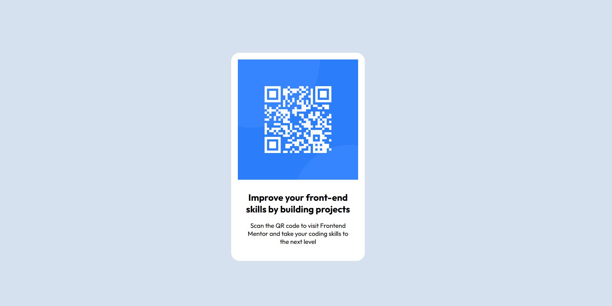

# Frontend Mentor - QR code component solution

This is a solution to the [QR code component challenge on Frontend Mentor](https://www.frontendmentor.io/challenges/qr-code-component-iux_sIO_H). Frontend Mentor challenges help you improve your coding skills by building realistic projects. 

## Table of contents

- [Overview](#overview)
  - [Screenshot](#screenshot)
  - [Links](#links)
- [My process](#my-process)
  - [Built with](#built-with)
  - [What I learned](#what-i-learned)
- [Author](#author)

## Overview

### Screenshot



Add a screenshot of your solution. The easiest way to do this is to use Firefox to view your project, right-click the page and select "Take a Screenshot". You can choose either a full-height screenshot or a cropped one based on how long the page is. If it's very long, it might be best to crop it.

Alternatively, you can use a tool like [FireShot](https://getfireshot.com/) to take the screenshot. FireShot has a free option, so you don't need to purchase it. 

Then crop/optimize/edit your image however you like, add it to your project, and update the file path in the image above.


### Links

- Solution URL: [Add solution URL here](https://github.com/JuanCris09/qr-code)
- Live Site URL: [Add live site URL here](https://juancris09.github.io/qr-code/)

## My process

### Built with

- Semantic HTML5 markup
- CSS custom properties
- Flexbox
- CSS Grid
- Mobile-first workflow
- Responsive

### What I learned

Use this section to recap over some of your major learnings while working through this project. Writing these out and providing code samples of areas you want to highlight is a great way to reinforce your own knowledge.

To see how you can add code snippets, see below:

```html
<main class="card">
      
      <div class="card-content">
        <h1 class="title">
          Improve your front-end skills by building projects
        </h1>
        <p class="parrafo">
          Scan the QR code to visit Frontend Mentor and take your coding skills
          to the next level
        </p>
      </div>
    </main>
```
```css
@media (max-width: 376px){
    main{
        margin: 9.78125rem 1.71875rem 9.78125rem 1.71875rem;
    }
}
```


## Author

- Website - [Juan Pablo Cristancho](https://www.your-site.com)
- Frontend Mentor - [@JuanCris09](https://www.frontendmentor.io/profile/JuanCris09)

